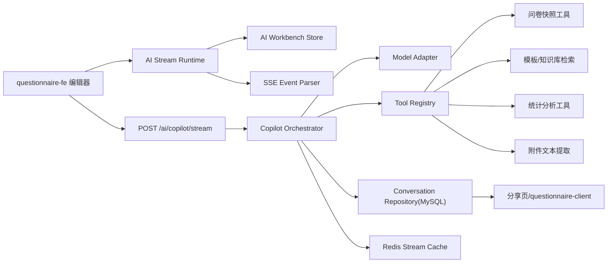

# 方案评审-问卷AI助手对标Sky-Chat升级

> 关联入口：[[问卷项目_前端暑期实习简历功能梳理]]
> 
> 目标：基于 `questionnaire` 现有 AI 问卷助手实现，对标你给出的 Sky-Chat 图片亮点，评估哪些能力值得做、当前差距在哪里、如果要做应该怎么分阶段落地。

> [!question] 用户描述，待产品确认
> 这里的“对标 Sky-Chat”不应理解为把问卷项目改造成通用 AI 聊天应用，而应理解为把现有“问卷 Copilot”升级为更完整的“问卷领域 AI 工作台”。

## 1. 背景与目标

Sky-Chat 图片里的亮点，核心不是“聊天页面做得花”，而是三层能力已经比较完整：

1. **流式传输层**：`Fetch + ReadableStream + 自定义 SSE 解析`
2. **工作流状态层**：`thinking -> tool_calling -> answering` 这类可观测状态机
3. **渲染与性能层**：`buffer 队列 + requestAnimationFrame + 虚拟滚动 + 布局稳定`

如果把这套思路翻译到问卷场景，真正有价值的目标应该是：

1. 让 AI 助手不只是“一次性生成问卷”，而是一个**可持续对话、可追踪阶段、可引用上下文、可回放会话**的问卷工作台
2. 让 AI 不只靠“吐文本 + 前端正则解析”，而是具备**工具调用、文件输入、统计查询、模板检索**等问卷领域能力
3. 让长会话、长草稿、长 Markdown 输出在前端依然**流畅、稳定、可控**

我的结论是：

- **值得优先做**：统一流式运行时、阶段状态机、会话持久化、工具调用、文件上传、渲染性能优化
- **可以第二阶段做**：对话分享、知识检索、语音交互
- **不建议短期照搬**：把管理端整体迁到 RSC、暴露原始思维链、先做通用图片生成

---

## 2. 当前方案概述

### 2.1 已有能力

当前项目并不是从零开始，已经有一版可用的问卷 AI 工作台雏形。

1. 编辑器页已经把 AI 面板挂到了左侧，把 AI 草稿预览挂到了中间区域，说明产品形态上已经不是独立弹窗，而是“编辑器内 Copilot 工作台”。
   - 代码证据：`packages/questionnaire-fe/src/pages/question/Edit/index.tsx:240-339`

2. Copilot 流式请求已经不是 `EventSource`，而是 `fetch + ReadableStream`，可以携带 `POST body` 和 `Authorization header`，这和 Sky-Chat 图片里的第一条亮点是同一路线。
   - 代码证据：`packages/questionnaire-fe/src/utils/streamRequest.ts:13-76`
   - 代码证据：`packages/questionnaire-fe/src/utils/sseFrameParser.ts:6-47`
   - 代码证据：`packages/questionnaire-fe/src/apis/modules/ai.ts:48-67`

3. 前端已经有一版生成工作流状态机，用于描述 `prompt 润色 -> 等待确认 -> 生成 -> 完成/取消/失败`。
   - 代码证据：`packages/questionnaire-fe/src/pages/question/Edit/components/aiCopilotTypes.ts:115-148`
   - 代码证据：`packages/questionnaire-fe/src/pages/question/Edit/hooks/aiGenerateFlowMachine.ts:7-119`

4. `useAiWorkbench` 已经处理了中断、自动重试、局部草稿、最终草稿、警告提示和应用到编辑器等完整链路。
   - 代码证据：`packages/questionnaire-fe/src/pages/question/Edit/hooks/useAiWorkbench.ts:430-786`

5. 后端已经有一套自定义 SSE 事件协议，包含 `meta / prompt_delta / prompt_refined / assistant_delta / draft_partial / draft / warning / done / error`。
   - 代码证据：`packages/questionnaire-be/src/service/ai/ai.service.ts:367-675`
   - 代码证据：`packages/questionnaire-be/src/service/ai/utils/write-sse-event.ts:3-17`

6. 后端当前的草稿协议仍然是“块标记 + JSON 解析”模式，而不是 function calling / tools。
   - 代码证据：`packages/questionnaire-be/src/service/ai/utils/parse-copilot-blocks.ts:3-137`

7. 项目依赖面上已经具备后续扩展的一些基础设施：前端已有 `react-markdown`，后端已有 `multer` 和 `redis`，仓库里还有一个独立的 Next.js 客户端子包。
   - 代码证据：`packages/questionnaire-fe/package.json:5-77`
   - 代码证据：`packages/questionnaire-be/package.json:19-53`
   - 代码证据：`packages/questionnaire-client/package.json:5-68`

### 2.2 当前方案的优点

1. **不是从 0 到 1，而是从 1 到 2**  
   现有项目已经有流式协议、问卷草稿预览、编辑器回填和生成/修改双模式，这意味着后续升级主要是“重构协议与运行时”，不是重写整个产品。

2. **问卷领域模型已经成型**  
   当前 AI 输出最终要落到 `QuestionnaireDraft` 和组件列表上，这种“结构化落地”能力比纯聊天应用更接近真实业务价值。

3. **编辑器上下文已经接入 AI**  
   AI 请求会带当前问卷快照、版本号和历史消息，这给后续做工具调用、版本校验和冲突保护提供了非常好的基础。
   - 代码证据：`packages/questionnaire-fe/src/pages/question/Edit/hooks/useAiWorkbench.ts:471-481`

4. **异常处理已经有初步意识**  
   当前已经处理了停止会话、失败提示、缺少 `END_DRAFT` 自动重试、警告信息提示，这比很多 demo 级 AI 页面成熟。
   - 代码证据：`packages/questionnaire-fe/src/pages/question/Edit/hooks/useAiWorkbench.ts:567-631`

---

## 3. 当前方案的问题和局限

### 3.1 协议层问题

1. **Copilot 协议仍是自定义文本块协议，不是工具调用协议**  
   当前后端靠 `<<<ASSISTANT_REPLY>>> / <<<COMPONENT>>> / <<<END_DRAFT>>>` 这类标记把大模型文本拆成结构块。  
   这在“生成一个草稿”场景还能工作，但一旦要支持 `thinking -> tool_calling -> answering`、文件解析、检索引用、统计查询、多 artifact 输出，就会越来越脆。
   - 代码证据：`packages/questionnaire-be/src/service/ai/utils/parse-copilot-blocks.ts:3-137`

2. **流式协议还没有“阶段事件”与“工具事件”**  
   目前只有 `assistant_delta / draft_partial / draft / done / error` 这一层；如果后面要展示“正在读取问卷”“正在检索模板”“正在生成建议”，协议表达力不够。

3. **AI 入口协议分裂**  
   Copilot 已经走了 `fetch + ReadableStream`，但老的 `generateQuestionnaire` / `analyzeQuestionnaire` 还走 `EventSource` 封装。  
   后续如果要统一监控、取消、重试、鉴权和能力开关，这种双协议会拖慢维护效率。
   - 代码证据：`packages/questionnaire-fe/src/apis/modules/ai.ts:10-45`
   - 代码证据：`packages/questionnaire-fe/src/utils/sseRequest.ts:1-21`

### 3.2 状态层问题

1. **现在的状态机只覆盖“润色/生成”主流程，不覆盖更复杂的 agent 生命周期**  
   当前 reducer 更接近“生成流程状态机”，还不是“问卷 AI 工作台状态机”。  
   它没有 `thinking / tool_calling / tool_done / citing / attachment_processing / sharing` 这些阶段。
   - 代码证据：`packages/questionnaire-fe/src/pages/question/Edit/hooks/aiGenerateFlowMachine.ts:42-118`

2. **消息状态、草稿状态、阶段状态、会话状态还没有分层**  
   `useAiWorkbench` 同时管消息数组、状态、草稿、摘要、重试、应用确认。当前规模还扛得住，但一旦引入多会话、文件、语音、分享，单 hook 会明显变重。

### 3.3 渲染与性能问题

1. **当前是“每个 chunk 直接触发 React 更新”**  
   `assistant_delta` 到来后会直接 `setMessages`，`draft_partial` 到来后会直接 `setDraftPartial`。  
   这意味着大模型流式输出越碎，重渲染越频繁。
   - 代码证据：`packages/questionnaire-fe/src/pages/question/Edit/hooks/useAiWorkbench.ts:495-553`

2. **消息列表是全量渲染，不是虚拟滚动**  
   `AiMessageList` 对 `messages` 直接 `.map()`，并且在 `messages` 或 `status` 每次变化后都自动滚到底部。  
   长会话、重试、多轮追问后，滚动性能和自动滚动体验都可能出问题。
   - 代码证据：`packages/questionnaire-fe/src/pages/question/Edit/components/AiMessageList.tsx:12-75`

3. **草稿预览也是全量映射，不是按块懒渲染或虚拟化**  
   `AiInlineQuestionnairePreview` 里会把当前问卷和草稿组件整块映射。  
   如果后面支持更长问卷、更复杂变更比对，性能压力会放大。
   - 代码证据：`packages/questionnaire-fe/src/pages/question/Edit/components/AiInlineQuestionnairePreview.tsx:259-440`

4. **没有显式的布局稳定策略**  
   当前没有看到 `requestAnimationFrame` 批量刷新、`overflow-anchor` 滚动锚定、Markdown 未闭合补全、骨架预估高度等机制。  
   这意味着后续如果把回答区升级为 Markdown 富文本，抖动概率会明显上升。
   - 代码证据：`packages/questionnaire-fe/src/pages/question/Edit/components/AiMessageList.tsx:15-18`
   - 代码证据：`packages/questionnaire-fe/src/pages/question/Edit/components/AiInlineQuestionnairePreview.tsx:259-440`

### 3.4 产品能力问题

1. **没有会话管理**  
   现在更像“编辑器内一次性本地对话”，不是可持久化的问卷 AI 工作台。

2. **没有附件输入**  
   无法把需求文档、访谈纪要、课程大纲、研究报告直接交给 AI 生成问卷。

3. **没有工具调用**  
   AI 无法显式调用“当前问卷快照”“题型物料库”“历史答案统计”“模板检索”等领域工具。

4. **没有分享与公开只读页**  
   无法把某次 AI 对话、某次分析结果或某个生成草稿分享给别人复核。

5. **没有语音和图片能力**  
   这不是最紧急的问题，但如果要做成“更像产品”的 AI 助手，后面会是加分项。

---

## 4. 哪些问题值得优化，哪些暂时不值得优化

### 4.1 值得优先优化

1. 统一流式运行时与事件协议
2. AI 工作台状态机升级
3. 会话持久化与会话列表
4. 工具调用与问卷领域工具注册
5. 文件上传与文本提取
6. 批量刷新、虚拟滚动、滚动锚定

### 4.2 可以第二阶段优化

1. 对话分享页
2. 模板检索 / 知识库检索
3. 语音输入 / 语音播报
4. 图片生成能力

### 4.3 暂时不建议做

1. **把整个 `questionnaire-fe` 改成 Next.js / RSC**  
   当前管理端是 Vite React，编辑器本身是高交互 SPA。  
   如果只是为了“分享页更快”，直接借用 `questionnaire-client` 这个 Next.js 子包承接只读分享页即可，没有必要整体迁移。
   - 代码证据：`packages/questionnaire-client/package.json:38-43`

2. **展示原始链路思维链**  
   Sky-Chat 的“思考模式”可以翻译为“阶段摘要”和“工具执行轨迹”，不建议把原始 CoT 全量暴露给用户，也不建议把它作为长期存储内容。

3. **让 AI 直接无确认写数据库**  
   问卷编辑器是强结构化页面，任何 AI 生成/修改都应该落到“草稿预览 -> 用户确认 -> 应用到编辑器”，不能跳过人工确认。

---

## 5. 完整优化技术方案

## 5.1 能力映射表

| Sky-Chat 亮点 | 问卷项目里的等价能力 | 是否建议做 | 优先级 |
|------|------|------|------|
| `Fetch + ReadableStream` SSE | 统一所有 AI 能力的流式传输层 | 是 | P0 |
| 有限状态机 | `thinking -> tool_calling -> answering -> draft_ready -> apply` | 是 | P0 |
| buffer 队列 + `requestAnimationFrame` | AI 消息和草稿分帧批量刷新 | 是 | P1 |
| 滚动锚定 / 骨架高度 / Markdown 稳定渲染 | 长回答与长草稿不抖动 | 是 | P1 |
| TanStack Virtual | 长会话和长草稿虚拟滚动 | 是 | P1 |
| 联网搜索 | 优先翻译成模板检索 / 知识库检索 / 历史问卷检索 | 有条件 | P2 |
| 文件上传 | 导入 PRD / 访谈纪要 / 课程大纲 / 报告生成问卷 | 是 | P2 |
| 思考模式 | 阶段摘要 + 工具轨迹，不暴露原始 CoT | 是 | P1 |
| 语音交互 | 语音输入需求、语音播报分析结果 | 可选 | P3 |
| 对话分享 | AI 生成记录与分析结论分享页 | 是 | P2 |
| 图片生成 | 问卷封面图 / 分享卡片 / 报告首图 | 可选 | P3 |
| RSC 分享页 | 在 `questionnaire-client` 承接只读页 | 可选 | P3 |

## 5.2 目标产品定位

升级后的能力不应叫“通用聊天机器人”，而应叫：

**问卷领域 AI Copilot 工作台**

它至少覆盖 6 类任务：

1. 根据自然语言需求生成问卷
2. 根据自然语言指令修改当前问卷
3. 基于答卷统计结果做智能分析
4. 根据上传文档生成初始问卷草稿
5. 检索模板、题库、历史问卷作为上下文
6. 将生成过程、分析结论和最终草稿沉淀为可分享资产

## 5.3 总体架构



这套架构的核心思想是：

1. 前端不要再把“收流、解析、状态机、渲染、会话持久化”都揉进一个 hook
2. 后端不要再只做“单次提示词拼装 + 文本标记解析”，而是升级为**编排器 + 工具注册表**
3. AI 生成结果不能直接写库，仍然走“生成草稿 -> 预览 -> 确认应用”

## 5.4 前端方案

### 5.4.1 前端模块拆分

建议新增或重构为以下模块：

1. `packages/questionnaire-fe/src/utils/stream/aiEventParser.ts`
   - 统一解析 SSE 帧
   - 支持多行 `data:`、心跳帧、`event id`

2. `packages/questionnaire-fe/src/utils/stream/aiStreamClient.ts`
   - 统一 `fetch + ReadableStream`
   - 统一鉴权、取消、超时、重试

3. `packages/questionnaire-fe/src/pages/question/Edit/hooks/useAiStreamRuntime.ts`
   - 负责流式接收、buffer 队列、`requestAnimationFrame` flush

4. `packages/questionnaire-fe/src/pages/question/Edit/hooks/useAiConversationController.ts`
   - 负责发送消息、切会话、重试、停止、恢复

5. `packages/questionnaire-fe/src/store/modules/aiConversationSlice.ts`
   - 存会话列表、当前会话元信息、分享状态、附件状态

6. `packages/questionnaire-fe/src/pages/question/Edit/components/AiSessionSidebar.tsx`
   - 会话管理、固定、重命名、删除、切换

7. `packages/questionnaire-fe/src/pages/question/Edit/components/AiThoughtTimeline.tsx`
   - 展示 `thinking / tool_calling / answering / drafting`

8. `packages/questionnaire-fe/src/pages/question/Edit/components/AiVirtualMessageList.tsx`
   - 虚拟滚动消息列表

9. `packages/questionnaire-fe/src/pages/question/Edit/components/AiAttachmentPanel.tsx`
   - 文件上传、解析状态、引用状态

### 5.4.2 状态分层

建议把前端状态拆成 4 层：

1. **stream raw layer**
   - 原始 chunk buffer
   - 原始 assistant 文本
   - 原始 draft patch
   - 用 `ref` 保存，不直接触发渲染

2. **runtime display layer**
   - 当前 UI 展示文本
   - 当前阶段状态
   - 当前 tool timeline
   - 每帧最多刷新一次

3. **conversation durable layer**
   - 会话列表
   - 消息持久化结果
   - 附件列表
   - 分享信息

4. **editor draft layer**
   - 当前问卷快照
   - AI partial draft
   - AI final draft
   - 应用确认状态

> [!info] 工程判断
> 当前 `useAiWorkbench` 仍可保留，但它更适合作为“页面级 orchestrator”，不适合继续同时承担 stream runtime 和 conversation store。

### 5.4.3 新的前端工作流状态机

建议把状态机从“生成流程状态机”升级为“工作台状态机”：

```ts
type AiWorkbenchPhase =
  | 'idle'
  | 'connecting'
  | 'thinking'
  | 'tool_calling'
  | 'tool_waiting'
  | 'answering'
  | 'drafting'
  | 'draft_ready'
  | 'awaiting_apply'
  | 'upload_processing'
  | 'sharing'
  | 'done'
  | 'cancelled'
  | 'error'
```

关键点：

1. `thinking` 不展示原始 CoT，只展示“阶段摘要”
2. `tool_calling` 要可视化当前调用了哪个工具
3. `drafting` 和 `answering` 分开，避免消息和草稿状态混在一起
4. `awaiting_apply` 明确表示“草稿已完成但未应用”

### 5.4.4 流式渲染性能优化

当前最值得借鉴 Sky-Chat 的点就在这里。

#### 方案 A：消息/草稿双缓冲队列

思路：

1. 流式事件先进入内存队列，不立刻 `setState`
2. 用一个 `requestAnimationFrame` 调度器，每帧统一 flush
3. flush 时一次性合并消息文本、阶段变化和草稿 patch

伪代码：

```ts
const pendingTextRef = useRef('')
const pendingDraftRef = useRef<QuestionnaireDraft | null>(null)
const rafIdRef = useRef<number | null>(null)

const scheduleFlush = () => {
  if (rafIdRef.current != null) return
  rafIdRef.current = requestAnimationFrame(() => {
    rafIdRef.current = null
    startTransition(() => {
      flushAssistantText(pendingTextRef.current)
      flushDraft(pendingDraftRef.current)
      pendingTextRef.current = ''
      pendingDraftRef.current = null
    })
  })
}
```

收益：

1. 把“每个 chunk 一次 render”压成“每帧一次 render”
2. assistant 文本和 draft partial 可以同步推进
3. 后面接多种事件也不会继续放大渲染频率

#### 方案 B：完整文本和展示文本分离

当前项目里 `rawReplyTextRef` 已经有雏形。
建议继续强化成两份状态：

1. `rawAssistantText`
   - 存最原始流式文本
2. `displayAssistantMarkdown`
   - 存适合当前帧展示的文本
   - 可做未闭合 Markdown 补全

这样可以解决：

1. 代码块未闭合时页面乱跳
2. 表格未结束时 Markdown AST 大范围重建
3. 后面接语音朗读或导出时还能拿到原始文本

#### 方案 C：自动滚动与滚动锚定分离

建议加入 3 个状态：

1. `autoFollow = true`
2. `userDetached = true`
3. `restoreFollowPending = true`

规则：

1. 用户在底部附近时自动跟随
2. 用户主动上滑后，停止自动滚动
3. 用户点击“回到底部”后恢复自动跟随
4. 容器层补 `overflow-anchor`

#### 方案 D：虚拟滚动

建议引入 `@tanstack/react-virtual`，优先应用在：

1. 消息列表
2. 会话列表
3. 超长草稿预览列表

当前前端依赖里没有虚拟列表库，因此这是一个明确的增量依赖。
- 代码证据：`packages/questionnaire-fe/package.json:5-77`

### 5.4.5 Markdown 与富文本渲染

前端依赖里已经有 `react-markdown`，所以不需要从 0 开始。
- 代码证据：`packages/questionnaire-fe/package.json:22`

建议补齐：

1. `remark-gfm`
2. `rehype-sanitize`
3. 代码块高亮方案
4. stream markdown stabilizer

问卷场景下适合渲染的内容包括：

1. AI 对问卷设计理由的说明
2. AI 对统计结果的分析结论
3. 工具检索返回的引用摘要
4. 分享页只读结果

## 5.5 后端方案

### 5.5.1 后端从“AI Service”升级为“Copilot Orchestrator”

建议保留现在的 `AiService` 入口，但把内部职责拆成：

1. `CopilotOrchestratorService`
   - 负责决定本轮是直答、生成草稿还是走工具链

2. `ConversationService`
   - 负责消息存储、会话标题、会话恢复

3. `ToolRegistryService`
   - 注册问卷领域工具

4. `AttachmentIngestService`
   - 文件解析、文本切块、摘要压缩

5. `ShareService`
   - 对话与分析结果分享

### 5.5.2 事件协议升级

建议在当前 SSE 事件基础上升级为：

```ts
type AiWorkbenchEvent =
  | { event: 'meta'; data: { requestId: string; conversationId: string; mode: 'generate' | 'edit' | 'analysis' } }
  | { event: 'phase'; data: { phase: 'thinking' | 'tool_calling' | 'answering' | 'drafting' } }
  | { event: 'thought_summary'; data: { text: string } }
  | { event: 'tool_call'; data: { toolCallId: string; name: string; args: Record<string, unknown> } }
  | { event: 'tool_result'; data: { toolCallId: string; name: string; ok: boolean; summary: string } }
  | { event: 'assistant_delta'; data: { delta: string } }
  | { event: 'draft_partial'; data: { draft: QuestionnaireDraft; progress: { componentsParsed: number } } }
  | { event: 'draft'; data: { reply: string; draft: QuestionnaireDraft; summary: DraftSummary } }
  | { event: 'artifact'; data: { type: 'share_card' | 'cover_image' | 'report_markdown'; url?: string; markdown?: string } }
  | { event: 'usage'; data: { inputTokens: number; outputTokens: number; latencyMs: number } }
  | { event: 'warning'; data: { code?: string; message: string } }
  | { event: 'done'; data: { ok: true } }
  | { event: 'error'; data: { code?: string; message: string; retryable?: boolean } }
```

这套协议的意义是：

1. 能驱动前端阶段状态机
2. 能展示工具调用轨迹
3. 能支持多种输出资产
4. 能把“聊天内容”和“结构化草稿”从协议层分开

### 5.5.3 工具调用设计

这是整个方案里最关键的升级点。

当前 AI Copilot 的真正短板，不是模型不够强，而是它还不能**显式调用问卷领域能力**。

建议首批工具：

1. `get_questionnaire_snapshot`
   - 输入：`questionnaireId`
   - 输出：当前问卷标题、描述、组件、版本号

2. `get_component_catalog`
   - 输入：空
   - 输出：支持的题型、字段约束、默认属性

3. `search_question_templates`
   - 输入：场景、行业、目标人群
   - 输出：模板片段、典型题目、引用来源

4. `get_answer_statistics`
   - 输入：`questionnaireId`
   - 输出：题目级统计、选项分布、文本题摘要

5. `get_open_answer_samples`
   - 输入：题目 id、数量限制
   - 输出：脱敏后的文本题样本

6. `read_attachment_text`
   - 输入：`attachmentId`
   - 输出：提取后的结构化文本摘要

7. `generate_cover_asset`
   - 输入：问卷主题、受众、语气
   - 输出：封面图 prompt 或图片地址

> [!info] 工程判断
> 对问卷项目来说，`工具调用` 的价值远大于“先做公网搜索”。因为问卷质量更依赖当前问卷结构、题型约束、历史答案和上传资料，而不是开放网络信息。

### 5.5.4 工具调用的安全边界

必须坚持 3 条边界：

1. AI 工具可以**读上下文、读统计、读附件、读模板**
2. AI 工具不能**直接写正式问卷数据**
3. 最终写回编辑器必须经过“草稿预览 -> 用户确认”

这样既能保住可控性，也能延续当前编辑器已经有的版本保护思路。

### 5.5.5 数据存储方案

建议优先使用 **MySQL + Redis**，不要新开一套会话数据库。

原因：

1. 会话、消息、分享、权限本质上是结构化业务数据，适合 MySQL
2. 当前后端已经有 Redis 依赖，可直接用于流式状态缓存、短 TTL 草稿缓存、幂等控制
3. 不需要为了聊天记录单独引入 Prisma / PostgreSQL
   - 代码证据：`packages/questionnaire-be/package.json:19-53`

建议新增表：

1. `ai_conversation`
   - `id`
   - `user_id`
   - `questionnaire_id`
   - `title`
   - `mode`
   - `is_pinned`
   - `last_message_at`
   - `created_at`
   - `updated_at`

2. `ai_message`
   - `id`
   - `conversation_id`
   - `role`
   - `phase`
   - `content_markdown`
   - `request_id`
   - `model`
   - `usage_json`
   - `error_json`
   - `created_at`

3. `ai_tool_trace`
   - `id`
   - `message_id`
   - `tool_name`
   - `tool_args_json`
   - `tool_result_summary`
   - `status`
   - `latency_ms`

4. `ai_attachment`
   - `id`
   - `conversation_id`
   - `user_id`
   - `file_name`
   - `mime_type`
   - `size`
   - `storage_key`
   - `parsed_text_status`
   - `parsed_text_excerpt`

5. `ai_share`
   - `id`
   - `conversation_id`
   - `share_token`
   - `expires_at`
   - `permission`

Redis 建议用途：

1. `ai:stream:{requestId}` 存当前阶段和心跳
2. `ai:draft:{conversationId}` 存最新 partial draft
3. `ai:upload:{attachmentId}` 存解析结果缓存
4. `ai:rate:{userId}` 做配额和限流

### 5.5.6 附件上传方案

后端依赖里已有 `multer`，所以文件上传不需要重造轮子。
- 代码证据：`packages/questionnaire-be/package.json:42`

建议第一期支持：

1. `.txt`
2. `.md`
3. `.docx`
4. `.pdf`

典型问卷场景：

1. 上传课程大纲，生成课程反馈问卷
2. 上传访谈纪要，生成用户研究问卷
3. 上传 PRD，生成产品满意度调研问卷
4. 上传活动方案，生成活动复盘问卷

后端流程：

1. 上传文件
2. 保存原文件到当前文件服务或对象存储
3. 提取文本
4. 文本切块与摘要压缩
5. 生成 `attachmentId`
6. 后续由 `read_attachment_text` 工具按需读取

安全要求：

1. 白名单 MIME 类型
2. 文件大小限制
3. 文本脱敏与 prompt injection 隔离
4. 上传人权限校验

## 5.6 会话管理与分享方案

### 5.6.1 会话管理

建议把当前一次性消息数组升级为真正的会话系统，至少支持：

1. 新建会话
2. 重命名会话
3. 删除会话
4. 置顶会话
5. 按问卷过滤会话
6. 恢复历史会话
7. 基于上一轮消息重试

这对问卷项目的价值非常直接：

1. 同一份问卷可以有多轮不同方向的生成尝试
2. 一份答卷分析可以保留历史分析上下文
3. 用户可以回看“为什么这样改”

### 5.6.2 分享页

Sky-Chat 图片里有“对话分享”。  
对问卷项目来说，分享目标更适合是：

1. 分享某次 AI 生成过程
2. 分享某次 AI 分析结论
3. 分享某个可确认的问卷草稿

实现建议：

1. 管理端 `questionnaire-fe` 负责发起分享、生成 token
2. 只读分享页放到 `questionnaire-client`
3. 分享页优先做 SSR / RSC，只读展示，不放复杂编辑能力

这样可以利用当前仓库已存在的 Next.js 子包，而不影响管理端编辑器架构。
- 代码证据：`packages/questionnaire-client/package.json:38-43`

## 5.7 语音与图片方案

### 5.7.1 语音交互

语音不是第一优先级，但做法比较清晰：

1. 前端使用 `MediaRecorder` 录音
2. 后端对接 STT 服务转文本
3. 转写结果进入当前输入框
4. 分析结果支持 TTS 播放

更适合问卷场景的切入点：

1. 口述需求生成问卷
2. 口述修改指令
3. 播报答卷分析结果

### 5.7.2 图片生成

不建议直接照搬“通用图片生成”，但可以翻译成 3 个问卷业务能力：

1. 生成问卷封面图
2. 生成分享卡片
3. 生成分析报告首图

如果做，建议把图片结果作为 `artifact` 事件流回前端，而不是混在 assistant 文本里。

## 5.8 RSC / SSR 方案

Sky-Chat 图片里提到“分享页 Markdown 渲染移到服务端，Page chunk 压缩”。

在问卷项目里，合理翻译方式是：

1. **管理端编辑器不迁移**
   - 继续保留 `questionnaire-fe` 的 Vite SPA 架构
2. **公开只读分享页和分析页放到 `questionnaire-client`**
   - 用 Next.js 做 SSR / RSC
3. **把重量级 Markdown 渲染和分享态 SEO 放在客户端子包处理**

这是比“整个管理端迁到 Next.js”成本更低、风险更小的方案。

---

## 6. 优化前后对比

| 维度 | 当前方案 | 升级后方案 |
|------|------|------|
| 流式传输 | Copilot 用 `fetch + ReadableStream`，其他 AI 能力仍有 `EventSource` | 全 AI 能力统一流式运行时 |
| 协议设计 | 文本块协议 + `draft_partial/draft` | 阶段事件 + 工具事件 + artifact 事件 |
| 状态机 | 仅覆盖润色/生成主链路 | 覆盖 thinking/tool_calling/answering/drafting/sharing |
| 渲染策略 | 每个 chunk 直接更新 React 状态 | buffer 队列 + `requestAnimationFrame` 批量刷新 |
| 会话管理 | 页面内临时消息数组 | 持久化会话、历史回放、重试、置顶 |
| 知识输入 | 当前问卷快照 + 历史消息 | 当前问卷 + 附件 + 模板检索 + 统计工具 |
| 分享能力 | 无 | 生成分享 token，Next.js 只读分享页 |
| 性能策略 | 全量渲染消息和草稿 | 虚拟滚动、滚动锚定、分块渲染 |

---

## 7. 分阶段实施方案

## Phase 0：统一底座

目标：不改产品外观，先把“协议、事件、运行时”打平。

交付内容：

1. 统一 `aiStreamClient`
2. 统一 SSE 事件类型定义
3. 将老 `generate/analysis` 入口迁到统一流式层
4. 后端补 `phase` 事件和 `conversationId`
5. 把 `useAiWorkbench` 拆出 stream runtime

收益：

1. 后续所有能力都能复用同一层
2. 取消、超时、日志、埋点口径统一

## Phase 1：核心体验升级

目标：让问卷 AI 助手从“能用”变成“像产品”。

交付内容：

1. 会话列表
2. 阶段状态机
3. tool timeline
4. `requestAnimationFrame` 批量刷新
5. 虚拟滚动消息列表
6. Markdown 渲染与稳定显示

收益：

1. 长会话可用性明显提高
2. Sky-Chat 图片里的核心交互亮点基本能对齐

## Phase 2：领域能力升级

目标：把“聊天”升级成“问卷领域 agent”。

交付内容：

1. 附件上传与文本提取
2. 模板检索
3. 统计分析工具调用
4. 历史问卷检索
5. 工具调用事件上屏

收益：

1. AI 不再只是靠大模型“猜”
2. 生成质量和分析可信度都会提升

## Phase 3：产品化增强

目标：补足分享、语音、封面图等产品能力。

交付内容：

1. 分享 token + 分享页
2. 语音输入 / 朗读
3. 封面图 / 分享卡片生成

## Phase 4：高级优化

目标：把性能和展示再往上推一档。

交付内容：

1. `draft_partial` 从“整份草稿快照”升级为“patch”
2. 分享页 SSR / RSC 优化
3. 更精细的缓存、预取和指标监控

---

## 8. 成本、风险与验收指标

### 8.1 成本与风险

1. **协议升级风险**
   - 前后端要同步改事件类型
   - 老逻辑要保兼容一段时间

2. **状态拆分风险**
   - `useAiWorkbench` 需要被拆分
   - 但这是必要的技术债处理

3. **工具调用风险**
   - 工具返回结构必须稳定
   - 必须控制写权限边界

4. **附件上传风险**
   - 解析耗时、文件安全、长文本 token 成本

### 8.2 验收指标

建议定义以下硬指标：

1. 长回答流式渲染频率控制在“每帧一次刷新”级别
2. 200 条消息以上会话滚动仍然流畅
3. AI 阶段状态可被完整回放
4. 用户可恢复历史会话并继续对话
5. 上传文档后可稳定生成问卷草稿
6. 统计分析场景可展示工具调用来源
7. 分享页可只读打开且不暴露编辑权限

---

## 9. 面试或汇报时怎么表达

如果后面你真把这套方案做出来，最适合的表达不是：

“我做了一个像 Sky-Chat 的聊天页面。”

更好的表达应该是：

“我把原本一次性生成问卷的 AI 功能，升级成了编辑器内的领域 Copilot 工作台。技术上我统一了 `fetch + ReadableStream` 的流式运行时，把 AI 生命周期抽成阶段状态机，引入了问卷快照、模板检索、统计查询、附件解析等工具调用能力，并通过 buffer 队列、`requestAnimationFrame`、虚拟滚动和滚动锚定解决长会话流式渲染的性能与稳定性问题。最终用户既能持续对话生成/修改问卷，也能把结果以草稿、分析结论和分享页的形式沉淀下来。” 

这比“接了个大模型接口”更像真正的工程能力。

---

## 10. 最终建议

如果你现在只打算做最关键的一版，我建议优先顺序是：

1. **统一流式运行时 + 协议升级**
2. **会话管理 + 阶段状态机**
3. **渲染性能优化**
4. **工具调用**
5. **附件上传**

先把这 5 件事做完，你的问卷 AI 助手在工程完成度上就已经能明显向 Sky-Chat 图片里的亮点靠近，而且这个方向仍然是“问卷产品增强”，不会把项目做偏。
