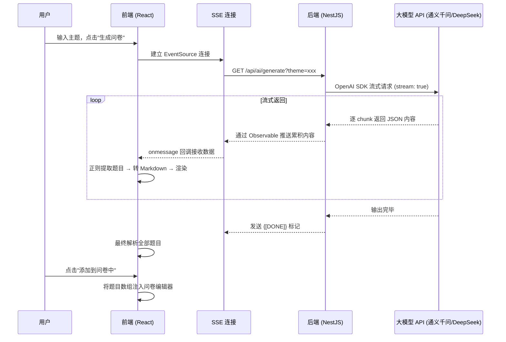

# AI 生成问卷功能 · 前后端实现详解

## 整体架构



---

## 第一步：用户触发生成

**文件**: [GenerrateDialog.tsx](file:///d:/02-前端/01-myProject/xiaomuwenjuan/react-questionnaire/packages/questionnaire-fe/src/pages/question/Edit/components/GenerrateDialog.tsx)

用户在问卷编辑页面打开 AI 生成弹窗，输入一个**主题**（如"大学生消费习惯"），点击 **"生成问卷"** 按钮：

```tsx
// 第 124-161 行
const handleButtonClick = () => {
  setIsGenerating(true)
  // 调用 API，建立 SSE 连接
  const { eventSource, onMessage, onError, close } = apis.aiApi.generateQuestionnaire(theme)
  
  let cacheData = '' // 缓存累积数据

  onMessage(data => {
    if (data === '{[DONE]}') {
      close() // 生成完毕，关闭连接
      printCurQuestion(cacheData) // 最终解析
      setIsGenerating(false)
    } else {
      cacheData = data
      printCurQuestionThrottled(cacheData) // 节流更新 UI
    }
  })
}
```

---

## 第二步：前端发起 SSE 请求

### API 层

**文件**: [ai.ts](file:///d:/02-前端/01-myProject/xiaomuwenjuan/react-questionnaire/packages/questionnaire-fe/src/apis/modules/ai.ts)

```ts
const generateQuestionnaire = (theme: string, count = 10, model?: string) => {
  let url = `${prefix}/generate?theme=${theme}&count=${count}`
  if (model) url += `&model=${model}`
  const { eventSource, onMessage, onError, close } = useSseRequest(url)
  return { eventSource, onMessage, onError, close }
}
```

### SSE 工具

**文件**: [sseRequest.ts](file:///d:/02-前端/01-myProject/xiaomuwenjuan/react-questionnaire/packages/questionnaire-fe/src/utils/sseRequest.ts)

使用浏览器原生 `EventSource` API 建立单向服务器推送连接：

```ts
const sseRequest = (url: string) => {
  const eventSource = new EventSource(url)
  return {
    eventSource,
    onMessage: (callback) => { eventSource.onmessage = e => callback(e.data) },
    onError:   (callback) => { eventSource.onerror   = e => callback(e)      },
    close:     ()         => { eventSource.close()                            }
  }
}
```

> [!NOTE]
> SSE（Server-Sent Events）是一种 HTTP 长连接技术，服务端可以持续向客户端推送数据。与 WebSocket 不同，SSE 是**单向**的（服务端 → 客户端），非常适合 AI 流式输出场景。

---

## 第三步：后端接收请求 (Controller)

**文件**: [ai.controller.ts](file:///d:/02-前端/01-myProject/xiaomuwenjuan/react-questionnaire/packages/questionnaire-be/src/service/ai/ai.controller.ts)

NestJS 使用 `@Sse()` 装饰器声明 SSE 端点，返回 `Observable<MessageEvent>`：

```ts
@Public()           // 无需鉴权
@Controller('ai')
export class AiController {
  @Sse('generate')  // GET /api/ai/generate
  generate(
    @Query('theme') theme: string,
    @Query('count') count: number,
    @Query('model') model: string,
  ): Promise<Observable<MessageEvent>> {
    return this.aiService.generate(theme, count || 10, model);
  }
}
```

> [!TIP]
> NestJS 的 `@Sse()` 会自动设置 `Content-Type: text/event-stream` 响应头，并将 Observable 的每次 `next()` 调用转为一条 SSE 消息。

---

## 第四步：后端调用大模型 (Service 核心)

**文件**: [ai.service.ts](file:///d:/02-前端/01-myProject/xiaomuwenjuan/react-questionnaire/packages/questionnaire-be/src/service/ai/ai.service.ts)

### 4.1 模型配置

**文件**: [dev.yml](file:///d:/02-前端/01-myProject/xiaomuwenjuan/react-questionnaire/packages/questionnaire-be/src/config/dev.yml)

支持 3 种模型，全部走阿里云 DashScope 兼容 OpenAI 的接口：

| 模型 | 标识 | 说明 |
|------|------|------|
| 通义千问 Max | `qwen-max` | 最强大，默认模型 |
| 通义千问 Plus | `qwen-plus` | 速度更快 |
| DeepSeek V3 | `deepseek-v3` | 性能优异 |

### 4.2 Prompt 工程

服务端构建了一个**结构化 Prompt**，要求 AI 以特定 JSON 格式输出问卷：

```
生成一份关于${theme}的问卷，要求如下：
1. 问卷需包含${count}个问题
2. 输出格式为 JSON，包含 survey.questions[] 数组
3. 每道题包含 fe_id、type、title、props
4. type 必须是以下之一：
   - questionTitle（分段标题）
   - questionShortAnswer（简答题）
   - questionRadio（单选题）
   - questionCheckbox（多选题）
   - questionDropdown（下拉选择题）
   - questionRating（评分题）
   - questionNPS（NPS 评分题）
   - questionMatrixRadio（矩阵单选题）
   - ... 等 12 种题型
```

> [!IMPORTANT]
> Prompt 中定义的题型 `type` 值（如 `questionRadio`）**与前端编辑器的组件类型完全对应**，这是 AI 生成的题目能直接导入编辑器的关键。

### 4.3 流式调用 & 推送

```ts
async generate(theme, count, modelName): Promise<Observable<MessageEvent>> {
  const client = this.createClientForModel(modelName); // 选择模型

  return new Observable((subscriber) => {
    let accumulatedContent = '';
    const abortController = new AbortController();

    client.chat.completions
      .create({
        messages: [{ role: 'system', content: prompt }],
        model: configuration().openai[useModel].model,
        stream: true,  // ⬅️ 关键：启用流式响应
      }, { signal: abortController.signal })
      .then(async (stream) => {
        for await (const chunk of stream) {
          accumulatedContent += chunk.choices[0].delta.content || '';
          subscriber.next({ data: accumulatedContent } as MessageEvent);
          // ⬆️ 每收到一个 chunk 就向前端推送「截至目前的全部累积内容」
        }
        subscriber.next({ data: '{[DONE]}' } as MessageEvent); // 完成标记
      });

    return () => { abortController.abort(); }; // 取消订阅时中止请求
  });
}
```

---

## 第五步：前端实时解析 & 渲染

回到 [GenerrateDialog.tsx](file:///d:/02-前端/01-myProject/xiaomuwenjuan/react-questionnaire/packages/questionnaire-fe/src/pages/question/Edit/components/GenerrateDialog.tsx)，收到 SSE 数据后：

### 5.1 正则提取 JSON 题目

**文件**: [regexp.ts](file:///d:/02-前端/01-myProject/xiaomuwenjuan/react-questionnaire/packages/questionnaire-fe/src/utils/regexp.ts)

```ts
// 匹配包含 "fe_id" 字段的 JSON 对象
questionRegExp: /\{[^{}]*(?:\{[^{}]*\}[^{}]*)*"fe_id":\s*"[^"]+"[^{}]*(?:\{[^{}]*\}[^{}]*)*\}/g
```

由于 AI 是流式输出 JSON，内容是逐步到达的。这个正则会从**累积的字符串**中提取出已经完整的题目 JSON 对象。

### 5.2 转换为 Markdown 展示

```ts
const formatQuestionsToMarkdown = (questions) => {
  return questions.map((q, i) => `
    ### 题目 ${i + 1}
    - 题型：${q.type}
    - 题目：${q.title}
    - 选项：...
  `).join('\n')
}
```

### 5.3 节流更新

```ts
// 每 1000ms 最多更新一次 UI，避免频繁渲染
const printCurQuestionThrottled = throttle((content) => {
  const questions = parseQuestionsFromContent(content)
  setFormattedContent(formatQuestionsToMarkdown(questions))
}, 1000)
```

使用 `ReactMarkdown` 组件将 Markdown 渲染到弹窗中，同时自动滚动到底部。

---

## 第六步：添加到问卷

用户满意生成结果后，点击 **"添加到问卷中"** 按钮：

```tsx
const handleAddToQuestionnaire = () => {
  if (currentQuestions.length > 0) {
    addQuestions(currentQuestions) // 回调：将题目数组传递给问卷编辑器
    close()
  }
}
```

`addQuestions` 是父组件传入的回调，负责将解析好的题目对象数组直接插入到问卷的组件列表中。

---

## 涉及的全部文件汇总

| 层级 | 文件 | 职责 |
|------|------|------|
| **后端 Controller** | [ai.controller.ts](file:///d:/02-前端/01-myProject/xiaomuwenjuan/react-questionnaire/packages/questionnaire-be/src/service/ai/ai.controller.ts) | 定义 SSE 端点 `/api/ai/generate` |
| **后端 Service** | [ai.service.ts](file:///d:/02-前端/01-myProject/xiaomuwenjuan/react-questionnaire/packages/questionnaire-be/src/service/ai/ai.service.ts) | Prompt 构建 + OpenAI 流式调用 + Observable 推送 |
| **后端 Module** | [ai.module.ts](file:///d:/02-前端/01-myProject/xiaomuwenjuan/react-questionnaire/packages/questionnaire-be/src/service/ai/ai.module.ts) | NestJS 模块注册 |
| **后端 Config** | [dev.yml](file:///d:/02-前端/01-myProject/xiaomuwenjuan/react-questionnaire/packages/questionnaire-be/src/config/dev.yml) | 模型 API Key / BaseURL 配置 |
| **前端 API** | [ai.ts](file:///d:/02-前端/01-myProject/xiaomuwenjuan/react-questionnaire/packages/questionnaire-fe/src/apis/modules/ai.ts) | 封装 SSE 请求 |
| **前端 SSE 工具** | [sseRequest.ts](file:///d:/02-前端/01-myProject/xiaomuwenjuan/react-questionnaire/packages/questionnaire-fe/src/utils/sseRequest.ts) | EventSource 封装 |
| **前端 UI 组件** | [GenerrateDialog.tsx](file:///d:/02-前端/01-myProject/xiaomuwenjuan/react-questionnaire/packages/questionnaire-fe/src/pages/question/Edit/components/GenerrateDialog.tsx) | 弹窗 UI + 实时解析渲染 |
| **前端正则** | [regexp.ts](file:///d:/02-前端/01-myProject/xiaomuwenjuan/react-questionnaire/packages/questionnaire-fe/src/utils/regexp.ts) | 从流式内容中提取完整 JSON 题目 |
